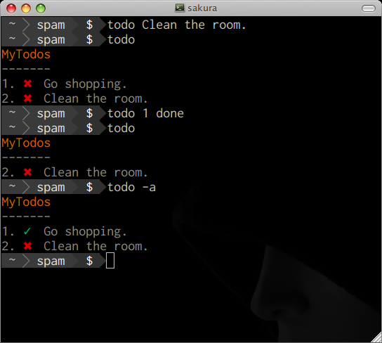

todo
----

Cli todo tool with readable storage.




Install
-------


latest version: [v0.2.0](https://github.com/secreek/todo/tree/v0.2.0)

offline version(No `gist` support): [v0.1.4](https://github.com/secreek/todo/tree/v0.1.4)

Use pip to install it from github.com:

    [sudo] pip install git+git://github.com/secreek/todo.git@v0.2.0

Usage
------

```
Usage:
  todo [-h|-v|-a]
  todo clear
  todo push
  todo pull [<name>]
  todo name [<new_name>]
  todo gist_id [<new_gist_id>]
  todo (<id> [done|undone|remove])|<task>...

Options:
  -h --help      show this message
  -v --version   show version
  -a --all       show all

Examples:
  Add a task                    todo Go shopping!
  Check a task as done          todo 1 done
  Check a task as undone        todo 1 undne
  Print all tasks               todo --all
  Print undone tasks            todo
  Remove a task                 todo 1 remove
  Rename the todo               todo name <a-new-name>
  Get the name of todo          todo name
  Push to gist.github.com       todo push
  Pull todo from gist           todo pull my_todo
  Set gist's id                 todo gist_id xxxxx
  Get gist's id                 todo gist_id

You can edit the todo.txt directly.
```

I just think to edit the `todo.txt` is the better way.

Storage
-------

**Note** `todo` will always use `./todo.txt` prior to `~/todo.txt` for persistent storage.

Well, the storage is readable, sample:

```
1. [x] Clean the room
2.     Go shopping.
```

Or checkout this file: [todo.txt](todo.txt)


Remote storage
---------------

`todo` use `gist.github.com` as remote storage. 

**Note** if this function bothers you, choose the version [v0.1.4](https://github.com/secreek/todo/tree/v0.1.4) may help.

To push the `todo.txt` to gist.github.com:

    todo push

To pull it down(will cover the local todo.txt):

    todo pull <todo-name>  # <todo-name> is optional

As the gist is git powered in the backend, we can review the history versions of todo.

The mapping schema from local os to remote server:

```
{local: todo.txt} => {remote: gist.github.com/gist_id, file: todo.name}
```

Well the gist_id & github's token is stored in `~/.todo/`. `todo` only asks you once for `login` and `password`(to get token).

License
--------

MIT
